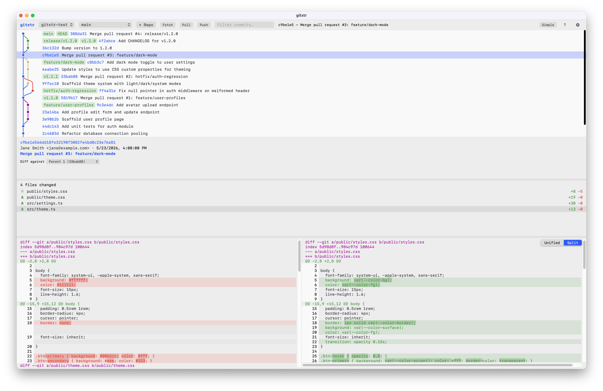

# gitxtr

A cross-platform desktop Git client with a fast, readable commit graph and the
day-to-day tools to work in a repository without leaving the app.



## Features

- **Commit graph** — a clear, navigable history view with multi-repo switching and a branch picker.
- **Diffs** — side-by-side and unified diff views with per-file navigation.
- **Working tree** — stage, unstage, and discard changes; commit from an in-app modal.
- **History & blame** — file history and line-level blame.
- **Branching & rebase** — branch operations and interactive rebase.
- **Remotes** — fetch, pull, and push.
- **Integrated terminal** — a VS Code-style terminal (xterm.js) pinned to your repo.
- **Themes & settings** — appearance, fonts, iTerm color themes, and keyboard shortcuts.
- **Auto-update** — in-app updates for the official builds (Velopack).

## Tech stack

- **Host:** C# / .NET 10 with [Photino.NET](https://www.tryphotino.io/) for the native window.
- **Frontend:** TypeScript bundled with [Vite](https://vite.dev/), terminal via [xterm.js](https://xtermjs.org/).
- **Git:** LibGit2Sharp plus the `git` CLI for remote operations.
- **Packaging:** [Velopack](https://velopack.io/) installers and delta updates.

## Platforms

macOS (arm64), Windows (x64 and arm64), and Linux (x64).

## Install

Download a signed installer for your platform from the
[Releases](https://github.com/jlederman/gitxtr/releases) page. Installed builds
update themselves in the background.

## Build from source

You need the **.NET 10 SDK** and **Node.js / npm** on your `PATH`. The web UI is
built automatically as part of the .NET build.

```sh
make install        # npm install + dotnet restore
make run            # production-style run (built bundle)
make run REPO=/path/to/repo
```

For development with hot reload, run the two dev targets in separate terminals:

```sh
make web            # terminal 1: Vite dev server (frontend HMR)
make app REPO=/path # terminal 2: .NET host with hot reload, UI served from the dev server
```

Other useful targets (`make help` lists them all):

```sh
make build          # dotnet build (also builds the web bundle)
make test           # run the domain tests
make format         # dotnet format (C#) + prettier (web)
make pack RID=osx-arm64 VERSION=1.2.3   # local unsigned installer → ./release
```

## License & editions

gitxtr is **source-available** under the
[PolyForm Internal Use License 1.0.0](LICENSE): you may build and run it from
source for your own and your company's internal use, free of charge. You may not
redistribute or resell it.

Building from source gives you the full app. The official prebuilt installers are
the convenient route; an advanced ("complex") tier unlocked by a license key is
planned for those builds.

## Development notes

- [Windows WebView2 blank-window post-mortem](docs/windows-arm64-webview2-debug.md) — why the Photino window must run on an STA thread on Windows.
